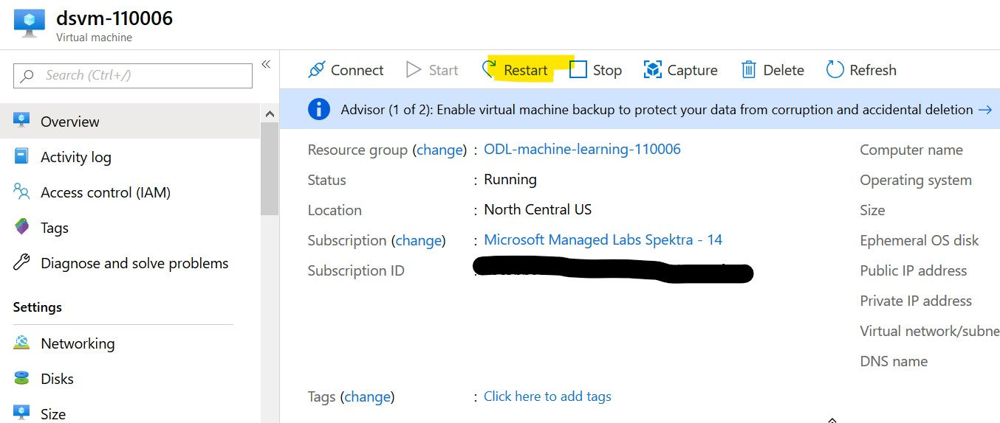

# Introduction 

In this course, you learn how to create an end-to-end data science solution, applying advanced machine learning (ML) approaches to a real-world scenario, variants of which can be found across industry verticals. This hands-on training covers various important machine learning algorithms. Use notebooks to understand the math behind data science and learn best practices for cleansing and manipulating your data to gather insights from it. Then, build an ML model on this data using techniques that will give you a foray into a data scientist’s work. Further, see MLOps (DevOps for ML) in action while learning how to productionize your models. Learn how to do the following: (1) perform data preparation and feature engineering with Pandas dataframes; (2) conduct model development with the Scikit-Learn ML library; (3) learn essentials of machine learning experimentation (model management and evaluation) with AML service; (4) perform tuning of hyperparameters with HyperDrive on AML Compute; (5) quickly find the best combination of ML algorithm and feature selection with automated machine learning; and (6) set up real-time scoring with Azure Kubernetes Services (AKS).

## Agenda

| time          | length | format | presenter          | topic                                                    |
| -             | -      | -      | -                  | -                                                        |
| 09:00 - 09:15 | 15 min | OPEN   | both               | Introducing instructors and going over course objectives |
| 09:15 - 09:30 | 15 min | SLIDES | Alexandre Vilcek   | Rquirements for an advanced ML platform                  |
| 09:30 - 10:00 | 30 min | LAB    |                    | Preparing lab environment and intro to Jupyter           |
| 10:00 - 10:15 | 15 min |        |                    | Break                                                    |
| 10:15 - 10:30 | 15 min | OPEN   | Alexandre Vilcek   | What we learn in this notebook                           |
| 10:30 - 11:00 | 30 min | LAB    |                    | Training an ML model using sklearn                       |
| 11:00 - 11:15 | 15 min | PORTAL | Alexandre Vilcek   | Wrap up and go over slides                               |
| 11:15 - 11:45 | 15 min | SLIDES | Seth Mottaghinejad | How Azure offers a comprehensive AI/ML platform          |
| 11:45 - 12:00 | 15 min |        |                    | Q&A                                                      |
| 12:00 - 13:00 | 60 min |        |                    | Lunch                                                    |
| 13:00 - 13:15 | 15 min | SLIDES | Seth Mottaghinejad | Introduce hyperdrive concepts                            |
| 13:15 - 13:45 | 30 min | LAB    |                    | Run through hyperdrive notebook                          |
| 13:45 - 14:00 | 15 min | PORTAL | Seth Mottaghinejad | Wrap up and go over slides                               |
| 14:00 - 14:15 | 15 min | SLIDES | Alexandre Vilcek   | Introduce AutoML and explainability concepts             |
| 14:15 - 14:45 | 30 min | LAB    |                    | Run through AutoML and explainability notebook           |
| 14:45 - 15:00 | 15 min | PORTAL | Alexandre Vilcek   | Wrap up and go over slides                               |
| 15:00 - 15:15 | 15 min |        |                    | Break                                                    |
| 15:15 - 15:30 | 15 min | SLIDES | Seth Mottaghinejad | Introduce deployment concepts                            |
| 15:30 - 16:15 | 45 min | LAB    |                    | Run through deployment notebook                          |
| 16:15 - 16:30 | 15 min | PORTAL | Seth Mottaghinejad | Wrap up deployment                                       |
| 16:30 - 17:00 | 30 min |        |                    | Wrap up and Q&A                                          |

## Lab setup

1. Log into [https://aka.ms/ignite-PRE12](https://aka.ms/ignite-PRE12) using activation code `IGNITE5301` and sign up to obtain your lab credentials.
1. Log into jupyter lab and follow instructor's quick introduction of Jupyter lab.
  - types of notebook cells
  - keyboard shortcuts
  - kernels and conda
1. Open a terminal window from Juyter by clicking on **New > Terminal** and type the following command to clone the course repository:
 	```
	# clone the course repo
	cd /data/home/labuser/notebooks
	git clone https://github.com/Azure/Ignite2019-pre-day.git
	```
1. Create a new cell and type in the following command and run it: 
	```
	!chmod 755 Ignite2019-pre-day/install_lab.sh
	!./Ignite2019-pre-day/install_lab.sh`
	```
1. Restart the data science virtual machine from the Azure portal by 
   - log into the [Azure portal](https://portal.azure.com/) using the credentials in the lab credentials page
   - click on **Resource groups** and click on your resource group name (should be something like `ODL-machine-learning-######`)
   - click on the virtual machine resource (should be named something like `dsvm-#####`), and
   
   - click on **Restart**
   

